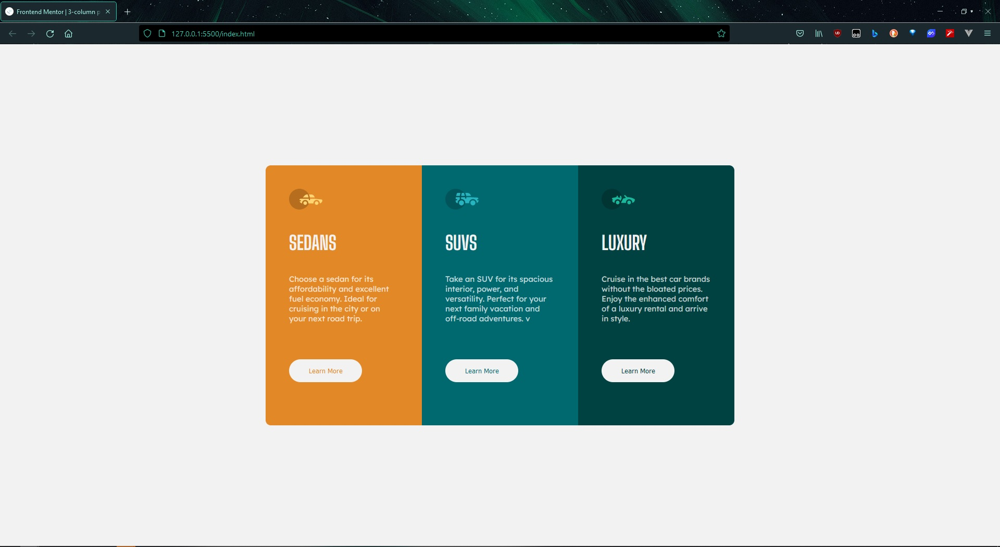

# Frontend Mentor - 3-column preview card component solution

This is a solution to the [3-column preview card component challenge on Frontend Mentor](https://www.frontendmentor.io/challenges/3column-preview-card-component-pH92eAR2-). Frontend Mentor challenges help you improve your coding skills by building realistic projects.

## Table of contents

- [Overview](#overview)
  - [The challenge](#the-challenge)
  - [Screenshot](#screenshot)
  - [Links](#links)
  - [Built with](#built-with)
- [Author](#author)

## Overview

### The challenge

Users should be able to:

- View the optimal layout depending on their device's screen size
- See hover states for interactive elements

### Screenshot

### Links

- Solution URL:[Solution URL](https://github.com/MubashirArifRandhawa/Frontend-Mentor-Challenges)
- Live Site URL:[Live Site](https://3-column-preview-component.surge.sh)

### Built with

- CSS custom properties
- Flexbox
- CSS Grid
- Mobile-first workflow

## Author

- Website - [Mubashir Arif Randhawa]
- Frontend Mentor - [@MubashirArifRandhawa](https://www.frontendmentor.io/profile/MubashirArifRandhawa)
- Twitter - [@Mubashi19311813](https://twitter.com/Mubashi19311813)
