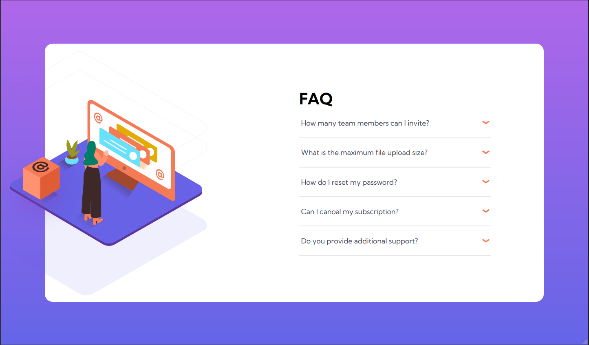

# Frontend Mentor - FAQ accordion card solution

This is a solution to the [FAQ accordion card challenge on Frontend Mentor](https://www.frontendmentor.io/challenges/faq-accordion-card-XlyjD0Oam). Frontend Mentor challenges help you improve your coding skills by building realistic projects.

## Table of contents

- [Overview](#overview)
  - [The challenge](#the-challenge)
  - [Screenshot](#screenshot)
  - [Links](#links)
- [My process](#my-process)
  - [Built with](#built-with)
  - [What I learned](#what-i-learned)
- [Author](#author)
- [Live Websiter Url](#live-site)
- [Code](#github)

## Overview

### The challenge

Users should be able to:

- View the optimal layout for the component depending on their device's screen size
- See hover states for all interactive elements on the page
- Hide/Show the answer to a question when the question is clicked

### Screenshot

### Links

- Solution URL: [Add solution URL here](https://your-solution-url.com)
- Live Site URL: [Add live site URL here](https://your-live-site-url.com)

## My process

### Built with

- CSS Only
- CSS custom properties
- Flexbox
- CSS Grid
- Position
- Detail Tag

### What I learned

#### Details tag

this tag is pre-built and is perfect for FAQ design, you can also check this tag. . It has a generic arrow so I saw this solution  on Stack overflow to change the arrow to whatever you want.

### Useful resources

- 
- 

## Author

- Coded By - Mubashir Arif Randhawa
- Frontend Mentor - [@MubashirArifRandhawa](https://www.frontendmentor.io/profile/MubashirArifRandhawa)
- Twitter - [@Mubashi19311813](https://twitter.com/Mubashi19311813)

## Live Site

## Github

