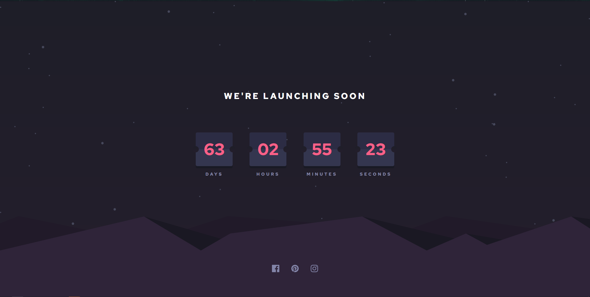
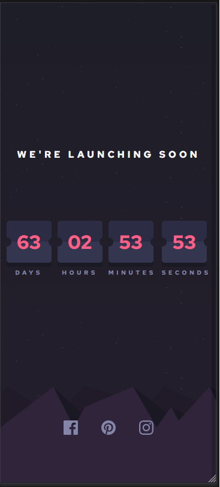

# Frontend Mentor - Launch countdown timer solution

This is a solution to the [Launch countdown timer challenge on Frontend Mentor](https://www.frontendmentor.io/challenges/launch-countdown-timer-N0XkGfyz-). Frontend Mentor challenges help you improve your coding skills by building realistic projects. 

## Table of contents

- [Frontend Mentor - Launch countdown timer solution](#frontend-mentor---launch-countdown-timer-solution)
  - [Table of contents](#table-of-contents)
  - [Overview](#overview)
    - [The challenge](#the-challenge)
    - [Screenshot](#screenshot)
    - [Links](#links)
  - [My process](#my-process)
    - [Built with](#built-with)
  - [Author](#author)

**Note: Delete this note and update the table of contents based on what sections you keep.**

## Overview

### The challenge

Users should be able to:

- See hover states for all interactive elements on the page
- See a live countdown timer that ticks down every second (start the count at 14 days)
- **Bonus**: When a number changes, make the card flip from the middle

### Screenshot

### Links

- Solution URL: [Github](https://github.com/MubashirArifRandhawa/Frontend-Mentor-Challenges)
- Live Site URL: [Live Site](https://countdown-timer-frontend-challenge.surge.sh)

## My process

### Built with

- Semantic HTML5 markup
- CSS custom properties
- Flexbox
- CSS Grid
- Date Object
- Filter Property CSS
- Background Layering

## Author

- Website - [Mubashir Arif Randhawa]
- Frontend Mentor - [@MubashirArifRandhawa](https://www.frontendmentor.io/profile/MubashirArifRandhawa)
- Twitter - [@Mubashi19311813](https://twitter.com/Mubashi19311813)
